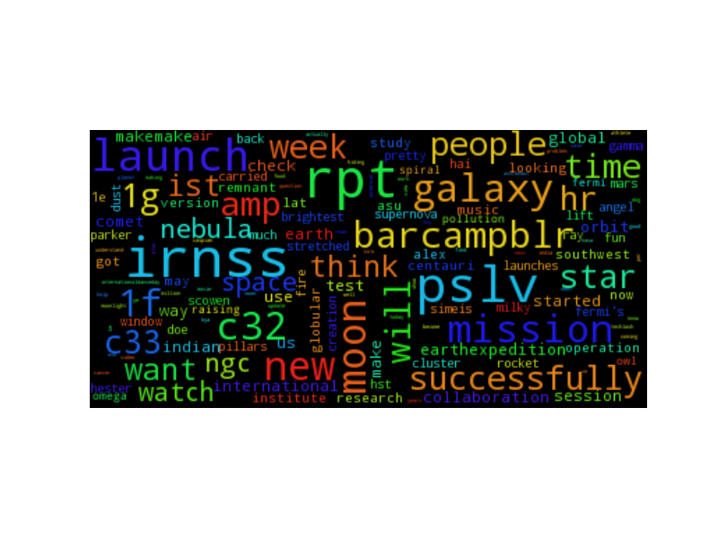
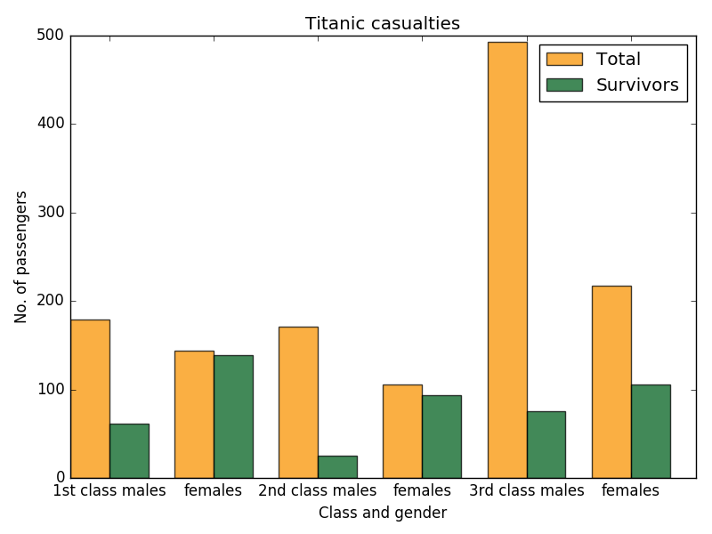
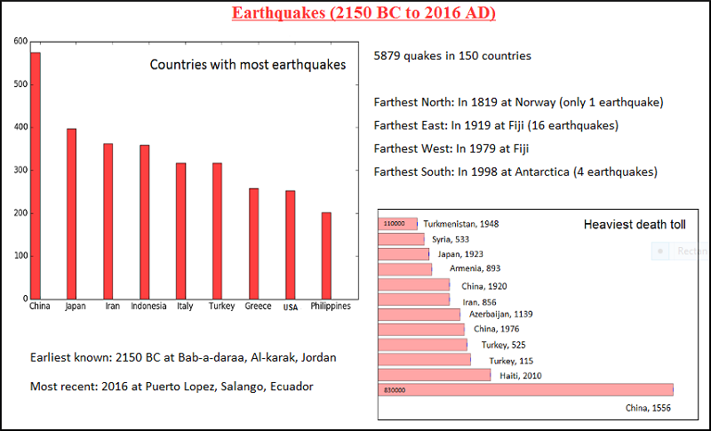

# Visualisations

A place to experiment with and learn visualisations. Contained herein are a few basic diagrams made with OpenOffice Calc, Python, and Microsoft Paint.

"Basic" means not very pretty, not very gaspworthy, just conveys the information.

## Samples

-    Tweet word cloud \(`tweet_cloud.py`\). Data is in a JSON file. Tweets are cleaned up for hashtags, punctuations, user names, and other unnecessary strings before feeding into the `wordcloud` library. The output is this image: 

-    Bar graph of Titanic survivors \(`bar_chart_titanic.py`\). Data is in a CSV file. The output is the following image. Will be enhanced to an infographic that contains a bit of contextual information.  

-    Composite infographic of bar graphs (`earthquakes.py`) and text. Data was in a tab-delimited TXT file. The output is this image:

-    _Work-in-progress_: Geo plot. Alexander's route. Am stuck because unable to install either Basemap or Cartopy.

## Repository file structure

-    The root folder contains the script files (`.py`)
-    The `data` folder contains source data
-    The `examples` folder contains the output

All related files have somewhat similar file names, and should be easy to identify as a set.

## References
-    wordcloud library: [amueller's wordcloud library](https://github.com/amueller/word_cloud)
-    bar chart code: [pylab's barchart demo](http://matplotlib.org/examples/pylab_examples/barchart_demo.html)
-    horizontal bar chart code: [Matplotlib's barh demo](http://matplotlib.org/examples/lines_bars_and_markers/barh_demo.html)
-    Titanic data: [Vanderbilt University's Department of Biostatistics's data set](biostat.mc.vanderbilt.edu/wiki/pub/Main/DataSets/titanic3.xls)
-    Earthquake data: [National Geophysical Data Center](www.ngdc.noaa.gov/hazard/earthqk.shtml)